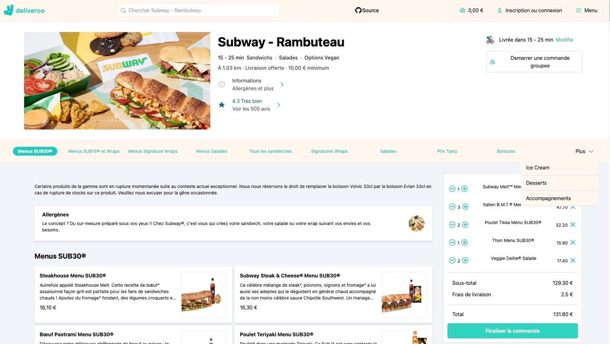

# Deliveroo project convert into Solid.js

This is a clone from a specific Deliveroo page using the real API (Rambuteau) from Le Reacteur, and I use this exercice to convert from React into Solid.js ! 

The data is fetched from the API endpoint made in the [Nextjs version repo](https://github.com/ShueiYang/deliveroo-next)

 

